<p align="center">
  
</p>

<h1 align="center">Zen</h1>

<p align="center">
  <strong>Run more agents than you can watch.</strong><br>
  A Brain on your own computer plans the work, gives each part to the right coding agent and reports to your phone.
</p>

<p align="center">
  <a href="https://github.com/daoleno/zen/releases"></a>
  <a href="https://github.com/daoleno/zen/actions/workflows/ci.yml"></a>
  <a href="LICENSE"></a>
</p>

<p align="center">
  
</p>

Zen is for one person running many coding agents. A Go daemon runs on your
Linux or macOS machine next to your repositories, `tmux` and agent CLIs. The
Android and iOS app connects to it. Zen is in **beta**; see [Status](#status).

## Brain

Give Brain a goal once. It records each part as durable Work, hands it to a
Worker, reads the result and decides what happens next. Workers are visible
`tmux` Sessions running an agent CLI; open any of them as Chat or as the live
Terminal and take over. Only Brain or you can mark Work done.

<p align="center">
  
</p>

Work, Attempt, Wake, Review and append-only Event records live in the daemon and
survive restarts. A quiet pane or an exited process never completes Work.

## Routing

Brain picks the executor, model and reasoning level for every Worker. Its guide
is `routing.md`, a few lines of Markdown in Brain's workspace. Zen never parses
it: Brain reads it before each spawn and judges the fit. When you state a
preference, Brain rewrites the line.

<p align="center">
  
</p>

```sh
zen worker spawn -name "Fix flaky test" -executor claude -model claude-opus-5-5 -reasoning high -cwd ~/repo -prompt "..."
```

## Models

`zen brain use <executor>` moves Brain to another agent client and keeps its
thread and history. Each Worker gets its own executor, model and reasoning; a
running Worker keeps the executor it started with. `codex`, `claude` and `pi`
take a reasoning level on their own scale. `grok`, `agent` (Cursor) and
`opencode` take a model only.

<p align="center">
  
</p>

## Quick start

Requirements: Linux (`amd64`/`arm64`), WSL2 or an Apple Silicon Mac, with
`tmux` and at least one authenticated agent CLI on `PATH`.

```sh
# 1. Install the daemon (checksum-verified, no sudo, no telemetry)
curl -fsSL https://raw.githubusercontent.com/daoleno/zen/main/install.sh | sh

# 2. Check the host, then start on a trusted private network
zen doctor
zen --lan

# 3. In another terminal, run the exact `zen pair ...` command that zen printed
```

4. Install the app: the Android arm64 APK from
   [Releases](https://github.com/daoleno/zen/releases) (see [Android](docs/android.md)),
   or build iOS from source (see [iOS](docs/ios.md)).
5. Scan the pairing code, then open **Brain**.

Away from your LAN, use Tailscale (`zen -addr "$(tailscale ip -4):9876"`), or a
Cloudflare Tunnel or reverse proxy with `zen pair https://your-origin`. See
[Connect and pair](docs/connect-and-pair.md).

## On your phone

- **Brain** and **Sessions**: a Worker as structured Chat, or its live Terminal
  rendered natively with libghostty.
- **Calendar**: reminders, deadlines and scheduled actions that run as visible
  Work and post their result to the Brain thread they came from.
- **Resources**: CPU, memory, pressure and disk, with processes attributed to
  Workers, Brain or Docker.
- **Git review**: read-only diffs of a Session's repository.
- **Stats**: usage per model, with unknown prices shown as unknown.
- Push notifications only when a Worker is blocked, fails or finishes.

## One owner

Zen serves one person. The daemon has an Ed25519 identity; a phone enrolls once
with a short-lived pairing code, then signs every request. The app follows
exactly one current server, and switching servers never mixes their data.
Repositories, credentials and agent state stay on your host. Paired phones see
what you open; model providers see what agents send them.
[Security and privacy](docs/security-and-privacy.md).

## Everyday commands

```sh
zen doctor                         # diagnose tmux, state, port and executors
zen pair [origin]                  # new one-time pairing code
zen devices list                   # paired phones
zen devices revoke -id <device-id>
zen update                         # verify and install the latest release

zen brain executors --json         # Brain host and available executors
zen brain use <executor>           # switch the agent that runs Brain
zen brain work list --json         # open Work (-all, -full, -id for history)
zen brain work update -id <work> -status done

zen worker list --json             # visible Workers
zen worker capture -id <id> --json # transcript
zen worker receipt -id <id> --work-id <work>  # was an input accepted?
zen worker send -id <id> --work-id <work> -text "follow-up"
zen worker close -id <id>
```

## Configure executors

No configuration is required: built-in defaults cover `codex`, `claude`,
`agent` (`cursor-agent`), `grok`, `pi` and `opencode`. One installed,
authenticated CLI is enough. To customise:

```sh
cp executors.example.toml ~/.zen/executors.toml   # then restart zen
```

> [!WARNING]
> Several defaults bypass approval prompts so agents can work unattended:
> `cursor-agent --force --sandbox disabled`, `grok --permission-mode bypassPermissions`,
> and Brain-delegated Codex adds `--dangerously-bypass-approvals-and-sandbox`.
> On machines with secrets or production access, use the safe profile in
> [`executors.example.toml`](executors.example.toml). See
> [Executors](docs/executors.md#permission-bypass-risks).

Model endpoints and API keys for Codex and Claude are set in the app under
**Settings > Agents > Model Providers**. They are stored on the daemon, never
shown back, and are separate from the Brain executor choice.

## Status

| Area | Status |
| --- | --- |
| Daemon on Linux `amd64`/`arm64`, WSL2, Apple Silicon macOS | Beta, released |
| Android app (arm64 APK on Releases) | Beta, released |
| iOS app | Source build. A [TestFlight preview](https://testflight.apple.com/join/rTKCDzMt) is awaiting Apple review |
| Brain, Workers, routing, durable Work lifecycle | Beta |
| Calendar scheduled actions, Telegram channel | Beta ([Calendar](docs/calendar.md), [Telegram](docs/telegram-brain-connection.md)) |
| Connections (Linear, Notion, GitHub, Slack, Google Workspace) | Preview; first-time connection is not ready for every service ([Plugins](docs/plugins.md)) |
| Zen Link relay | Optional source only. No hosted relay is operated. See [Zen Link Relay](docs/zen-link-relay.md) |
| Web client | Out of scope |

Known release issues: [docs/release-blockers.md](docs/release-blockers.md).

## Development

```sh
bun install                              # workspace deps (Bun 1.3)

# Daemon
bun run daemon:build                     # builds bin/zen
cd daemon && go test ./...
cd daemon && go run ./cmd/zen-dev        # hot-reloading dev daemon

# App
bun run app:start                        # Expo dev server
bun run app:android                      # needs Java 17
bun run app:ios
cd app && bun test && bunx tsc --noEmit

# Landing page (static, in site/)
bun run site:dev                         # prints the local preview URL
```

Layout: `daemon/` Go daemon (`cmd/zen`, `server`, `auth`, `brain`, `work`,
`lifecycle`, `terminal`, `watcher`); `app/` Expo app (routes in `app/app/`,
components, services, store); `docs/` product and operator docs; `site/`
landing page, whose `site/assets/*.svg` drawings this README also uses;
`scripts/` build and release tooling.

The native terminal uses libghostty; see [Android](docs/android.md#architecture--abi-contract)
and [iOS](docs/ios.md#native-terminal--xcframework-contract) for build contracts.
All documentation starts at [docs/README.md](docs/README.md).

## Contributing

Read [CONTRIBUTING.md](CONTRIBUTING.md) and [AGENTS.md](AGENTS.md). Keep
changes small, run the relevant checks, and never commit pairing links, `~/.zen`
state, tunnel URLs or `.env.local`. Report vulnerabilities as described in
[SECURITY.md](SECURITY.md).

## License

Apache License 2.0; see [LICENSE](LICENSE) and [NOTICE](NOTICE). The Zen name
and logos are covered by [TRADEMARKS.md](TRADEMARKS.md).
