<p align="center">
  
</p>

<h1 align="center">Zen</h1>

<p align="center">
  <strong>Every agent you run, in one hand.</strong><br>
  A phone app and a small daemon on your own computer. Every coding agent and shell there becomes a Session you can read as chat, drive as a live terminal, or hand to a Brain that splits the work.
</p>

<p align="center">
  <a href="https://github.com/daoleno/zen/releases"></a>
  <a href="https://github.com/daoleno/zen/actions/workflows/ci.yml"></a>
  <a href="LICENSE"></a>
</p>

<p align="center">
  
</p>

Zen is for one person running many coding agents. A Go daemon runs on your
Linux or macOS machine next to your repositories, `tmux` and agent CLIs. The
Android and iOS app connects to it. Zen is in **beta**; see [Status](#status).

Visit the [Zen homepage](https://daoleno.github.io/zen/) for an interactive overview.

## Sessions

Start Claude, Codex, Cursor, Grok, Pi, OpenCode, DSH or a plain Shell in any
directory on the host. Each one is a `tmux` session, so it is also there at the
desk. On the phone, open a Session as structured **Chat** (messages, tool calls,
plans, attachments) or as the live **Terminal**, rendered natively with
libghostty. **Git** shows read-only All, Working and Staged diffs for its
repository. Chat works with the six agent clients; any other command gets the
terminal.

<p align="center">
  
</p>

## Brain

Give Brain a goal once. It records each part as durable Work, picks a Worker
for it, reads the result and decides what happens next. Workers are ordinary
Sessions; open any of them and take over. Only Brain or you can mark Work done.

Brain's routing guide is `routing.md`, a few lines of Markdown in its
workspace. It reads the guide before each spawn to choose the executor, model
and reasoning level, and rewrites a line when you state a preference.
`zen brain use <executor>` moves Brain itself to another client and keeps its
thread.

<p align="center">
  
</p>

Details: [Architecture](docs/architecture.md), [Brain and Work](docs/brain-and-work.md),
[Work lifecycle](docs/work-lifecycle.md), [Worker routing](docs/executors.md#worker-routing).

## Around the agents

Everything reads from the one server the app is connected to.

<table>
  <tr>
    <td width="50%">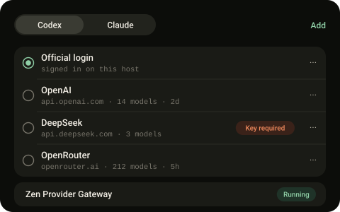<br><b>Model Providers</b>: official login or your own OpenAI, Anthropic, DeepSeek, OpenRouter or custom gateway keys, stored on the daemon.</td>
    <td width="50%">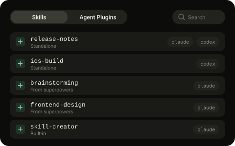<br><b>Skills</b>: the Skills and Agent Plugins your agents load, where each copy came from, and exact-copy removal.</td>
  </tr>
  <tr>
    <td><br><b>Plugins</b> (preview): Linear, Notion, GitHub, Slack, Google Workspace, custom MCP and OpenAPI. Read by default; changes are a separate switch.</td>
    <td>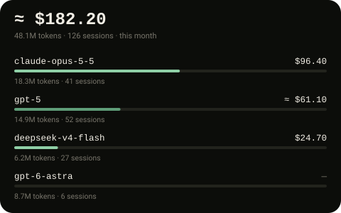<br><b>Usage</b>: tokens, sessions and cost per model, with reported, estimated and unknown costs kept apart.</td>
  </tr>
  <tr>
    <td>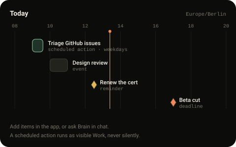<br><b>Calendar</b>: events, reminders, deadlines and scheduled actions that run as visible Work and post back to their Brain thread.</td>
    <td>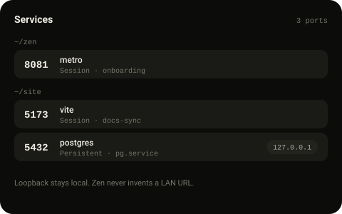<br><b>Services</b>: ports your Sessions opened, by project, with an optional temporary Cloudflare Quick Tunnel.</td>
  </tr>
  <tr>
    <td><br><b>Resources</b>: CPU, memory, disk and pressure, with processes attributed to Workers, Brain, Docker or you.</td>
    <td>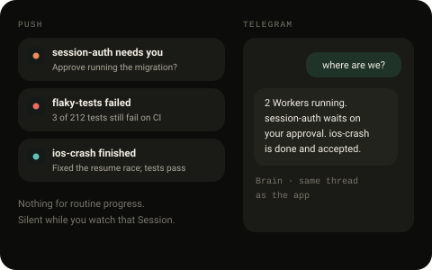<br><b>Alerts and Telegram</b>: push only when a Session is blocked, fails or finishes; Telegram as a second channel to the same Brain.</td>
  </tr>
</table>

## Quick start

Requirements: Linux (`amd64`/`arm64`), WSL2 or an Apple Silicon Mac, with
`tmux` and at least one authenticated agent CLI on `PATH`.

```sh
# 1. Install the daemon (checksum-verified, no sudo, no telemetry)
curl -fsSL https://raw.githubusercontent.com/daoleno/zen/main/install.sh | sh

# 2. Check the host, then start on a trusted private network.
#    With no device paired yet, zen prints a pairing QR code and link.
zen doctor
zen --lan
```

3. Install the app: the Android arm64 APK from
   [Releases](https://github.com/daoleno/zen/releases) (see [Install](docs/install-daemon.md#android)),
   or build iOS from source (see [Install](docs/install-daemon.md#ios)).
4. Scan the QR code (or paste the link in **Settings > Pair Server**), then open **Brain**.
5. Later devices: run `zen pair` for a fresh code, or open Zen in a browser on an
   HTTPS address and approve it from a paired device by matching the number it shows.

Away from your LAN, use Tailscale (`zen -addr "$(tailscale ip -4):9876"`), or a
Cloudflare Tunnel or reverse proxy with `zen pair https://your-origin`. See
[Connect and pair](docs/connect-and-pair.md).

## One owner

Zen serves one person. The daemon has an Ed25519 identity; a phone enrolls once
with a short-lived pairing code, then signs every request. The app follows
exactly one current server, and switching servers never mixes their data.
Repositories, credentials and agent state stay on your host. Paired phones see
what you open; model providers see what agents send them.
[Security and privacy](docs/security-and-privacy.md).

## Everyday commands

```sh
zen doctor                         # diagnose tmux, state, port and executors
zen pair [origin]                  # new one-time pairing code
zen devices list                   # paired phones
zen devices revoke -id <device-id>
zen update                         # verify and install the latest release

zen brain executors --json         # Brain host and available executors
zen brain use <executor>           # switch the agent that runs Brain
zen brain work list --json         # open Work (-all, -full, -id for history)
zen brain work update -id <work> -status done

zen worker list --json             # visible Workers
zen worker capture -id <id> --json # transcript
zen worker receipt -id <id> --work-id <work>  # was an input accepted?
zen worker send -id <id> --work-id <work> -text "follow-up"
zen worker close -id <id>
```

## Configure executors

No configuration is required: built-in defaults cover `codex`, `claude`,
`agent` (`cursor-agent`), `grok`, `pi` and `opencode`. One installed,
authenticated CLI is enough. To customise:

```sh
cp executors.example.toml ~/.zen/executors.toml   # then restart zen
```

> [!WARNING]
> Several defaults bypass approval prompts so agents can work unattended:
> `cursor-agent --force --sandbox disabled`, `grok --permission-mode bypassPermissions`,
> and Brain-delegated Codex adds `--dangerously-bypass-approvals-and-sandbox`.
> On machines with secrets or production access, use the safe profile in
> [`executors.example.toml`](executors.example.toml). See
> [Executors](docs/executors.md#permission-bypass-risks).

Model endpoints and API keys for Codex and Claude are set in the app under
**Settings > Agents > Model Providers**. They are stored on the daemon, never
shown back, and are separate from the Brain executor choice.

## Status

| Area | Status |
| --- | --- |
| Daemon on Linux `amd64`/`arm64`, WSL2, Apple Silicon macOS | Beta, released |
| Android app (arm64 APK on Releases) | Beta, released |
| iOS app | Source build. A [TestFlight preview](https://testflight.apple.com/join/rTKCDzMt) is awaiting Apple review |
| Brain, Workers, routing, durable Work lifecycle | Beta |
| Calendar scheduled actions, Telegram channel | Beta ([Calendar](docs/calendar.md), [Telegram](docs/notifications.md#telegram)) |
| Plugins (Linear, Notion, GitHub, Slack, Google Workspace) | Preview; first-time connection is not ready for every service ([Plugins](docs/plugins.md)) |
| Zen Link relay | Optional source only. No hosted relay is operated. See [Zen Link Relay](docs/internal/zen-link-relay.md) |
| Web client | Out of scope |

Known release issues: [docs/release-blockers.md](docs/release-blockers.md).

## Development

```sh
bun install                              # workspace deps (Bun 1.3)

# Daemon
bun run daemon:build                     # builds bin/zen
cd daemon && go test ./...
cd daemon && go run ./cmd/zen-dev        # hot-reloading dev daemon

# App
bun run app:start                        # Expo dev server
bun run app:android                      # needs Java 17
bun run app:ios
cd app && bun test && bunx tsc --noEmit

# Landing page (static, in site/)
bun run site:dev                         # prints the local preview URL
```

Layout: `daemon/` Go daemon (`cmd/zen`, `server`, `auth`, `brain`, `work`,
`lifecycle`, `terminal`, `watcher`); `app/` Expo app (routes in `app/app/`,
components, services, store); `docs/` product and operator docs; `site/`
landing page, whose `site/assets/*.svg` drawings this README also uses
(regenerate with `python3 scripts/site-svg/build.py`);
`scripts/` build and release tooling.

The native terminal uses libghostty; see [Android](docs/internal/android-development.md#architecture--abi-contract)
and [iOS](docs/internal/ios-development.md#native-terminal--xcframework-contract) for build contracts.
All documentation starts at [docs/README.md](docs/README.md).

## Contributing

Read [CONTRIBUTING.md](CONTRIBUTING.md) and [AGENTS.md](AGENTS.md). Keep
changes small, run the relevant checks, and never commit pairing links, `~/.zen`
state, tunnel URLs or `.env.local`. Report vulnerabilities as described in
[SECURITY.md](SECURITY.md).

## License

Apache License 2.0; see [LICENSE](LICENSE) and [NOTICE](NOTICE). The Zen name
and logos are covered by [TRADEMARKS.md](TRADEMARKS.md).
