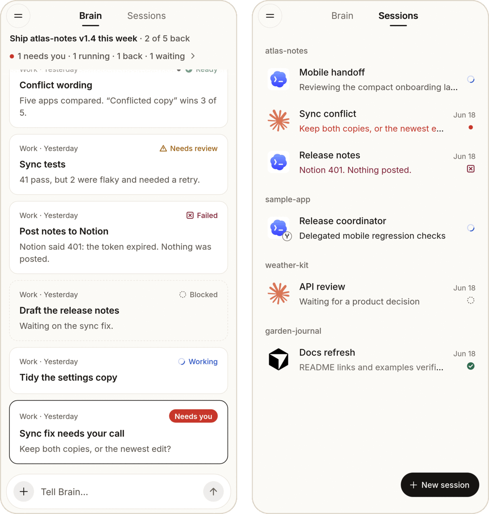

<p align="center">
  
</p>

<h1 align="center">Mewla</h1>

<p align="center">
  <strong>One person. A whole team.</strong><br>
  Tell Brain the goal. It leads a team of coding agents on your own computer, and calls you only when it matters.
</p>

<p align="center">
  <a href="https://github.com/daoleno/mewla/releases"></a>
  <a href="https://github.com/daoleno/mewla/actions/workflows/ci.yml"></a>
  <a href="LICENSE"></a>
</p>

<p align="center">
  <picture>
    <source media="(prefers-color-scheme: dark)" srcset="docs/assets/mewla-brain-wide-dark.png">
    
  </picture>
  <br><sub>Demo data.</sub>
</p>

Mewla is a phone app and a small daemon that runs next to your repositories.
The agents are the CLIs you already use (Claude Code, Codex, Cursor, Grok, Pi,
OpenCode), each in a real `tmux` session on your machine. Mewla gives them a
lead and gives you a remote. Open source, self-hosted, in beta.

[Homepage](https://daoleno.github.io/mewla/) · [Docs](https://daoleno.github.io/mewla/docs/) · [Releases](https://github.com/daoleno/mewla/releases)

## How it works

1. **Say it once.** "Ship atlas-notes v1.4 this week: fix the sync bug, tidy
   the settings copy, write release notes." In the app, or from Telegram.
2. **Brain splits it into Work** and picks an agent for each part, following
   `routing.md`, a file you edit.
3. **Real agents do it**, each in `tmux` on your computer. Read any of them as
   Chat or as the live Terminal, or take over from your phone.
4. **You hear about it only when it matters**: a push when an agent needs you,
   fails or finishes. In the app, its question comes with the answers as buttons.
5. **Nothing ships unchecked.** Brain reviews every result before it counts as
   done, and only Brain or you can close Work.

<p align="center">
  <picture>
    <source media="(prefers-color-scheme: dark)" srcset="docs/assets/mewla-phone-dark.png">
    
  </picture>
  <br><sub>Brain and Sessions on a phone. Demo data.</sub>
</p>

Around that loop: Calendar for things Brain should run later, Plugins so Brain
can read Linear, Notion and GitHub, your own model keys, usage and cost per
model, and a live view of what agents use on the machine.

## Get started

You need Linux (`amd64`/`arm64`), WSL2 or an Apple Silicon Mac, with `tmux`
and one signed-in agent CLI.

```sh
# 1. Install: checksum-verified, no sudo, no telemetry
curl -fsSL https://raw.githubusercontent.com/daoleno/mewla/main/install.sh | sh

# 2. Start on a network you trust; it prints a pairing QR code
mewla --lan
```

3. Install the app: the Android arm64 APK from
   [Releases](https://github.com/daoleno/mewla/releases), or
   [see iOS TestFlight status and source builds](docs/install-daemon.md#ios).
4. Scan the QR code. Open **Sessions** to start an agent, or **Brain** to give
   it a goal.

Away from home, use Tailscale or an HTTPS tunnel instead of `--lan`:
[Connect and pair](docs/connect-and-pair.md). The full path is in
[Get started](docs/get-started.md).

> [!WARNING]
> Brain's Workers run without approval prompts, and some built-in agent
> commands skip them too. On a machine with secrets or production access, read
> [Permission bypass risks](docs/executors.md#permission-bypass-risks) first.

## Status

| Part | Status |
| --- | --- |
| Daemon: Linux `amd64`/`arm64`, WSL2, Apple Silicon macOS | Beta |
| Android app (arm64 APK) | Beta |
| iOS app | TestFlight 0.2.4 (42) submitted; awaiting Apple Beta App Review |
| Web UI, served by the daemon | Beta; no QR scanning or push |
| Plugins | Preview; sign-in is not ready for every service |

Known issues: [Releases](docs/releases/README.md#known-issues).

## Documentation

- **Get it running:** [Get started](docs/get-started.md) · [Install and update](docs/install-daemon.md) · [Connect and pair](docs/connect-and-pair.md)
- **Use it:** [Sessions](docs/sessions.md) · [Brain and Work](docs/brain-and-work.md) · [Notifications and Telegram](docs/notifications.md) · [Calendar](docs/calendar.md) · [Plugins](docs/plugins.md)
- **Configure it:** [Agents and models](docs/executors.md) · [Usage and resources](docs/usage-and-resources.md)
- **Reference:** [Commands](docs/cli.md) · [Security and privacy](docs/security-and-privacy.md) · [Troubleshooting](docs/troubleshooting.md)

## Develop

```sh
bun install                           # workspace dependencies (Bun 1.3)
bun run daemon:build                  # builds bin/mewla
cd daemon && go test ./...
cd app && bun test && bunx tsc --noEmit
```

The daemon is Go in `daemon/`, the app is Expo/React Native in `app/`. Start
with [CONTRIBUTING.md](CONTRIBUTING.md), [AGENTS.md](AGENTS.md) and
[Architecture](docs/architecture.md). Report vulnerabilities as described in
[SECURITY.md](SECURITY.md).

## License

Apache License 2.0; see [LICENSE](LICENSE) and [NOTICE](NOTICE). The Mewla name
and seal-cat logo are covered by [TRADEMARKS.md](TRADEMARKS.md).
