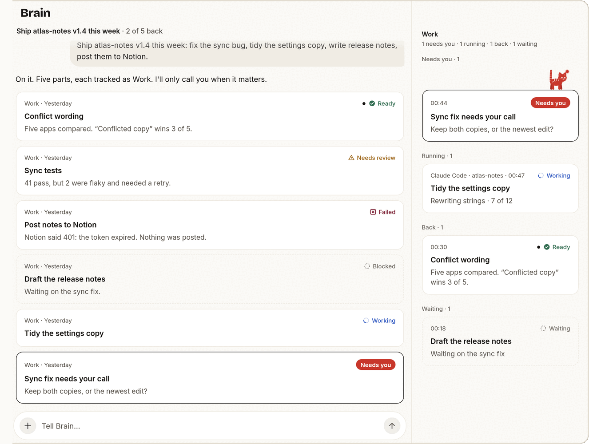

# Brain and Work

Brain is the agent that leads the others. Tell it a goal and your limits once.
It splits the goal into **Work**, hands each piece to a **Worker**, reads what
comes back and decides the next step. You don't have to type "continue", and
it calls you only when a decision is yours.

## The words

| Term | Meaning |
| --- | --- |
| Brain | One long-running agent Session on your computer, running on the agent you chose (its **host**). |
| Work | One durable piece of the goal: an objective, a status and its history. It survives restarts. |
| Worker | An ordinary, visible Session that Brain started for a piece of Work. You can open it and take over. |
| Brain thread | Brain's conversation. It keeps its history when Brain moves to another agent. |

## Give Brain a goal

Open **Brain** and say the outcome you want and anything Brain must not do:

> Ship atlas-notes v1.4 this week: fix the sync bug, tidy the settings copy,
> write release notes, post them to Notion.

Brain records each part as Work, starts Workers, and names the goal. Workers
run unattended, so read [Permission bypass risks](executors.md#permission-bypass-risks)
before you let Brain work on a machine with secrets.

## Follow the Work



*Demo data.*

**The goal line.** Under the Brain title, with how much has come back:
"Ship atlas-notes v1.4 this week · 2 of 5 back". Brain sets it; a new chat
starts without one.

**Slips in the conversation.** Each Work appears as one slip: agent, project
and time, its state, its title and one line of result. When a Work reports
again, its slip moves down to that moment instead of piling up copies.

| Mark | State |
| --- | --- |
| Check | Ready: done, or back and accepted |
| Spinning arc | Running, or Brain is reviewing the result |
| Red "Needs you" pill, dark outline | Waiting for your decision |
| Open triangle | Needs review, for example the Worker stopped reporting |
| Crossed box, with the cause | Failed |
| Dashed ring | Blocked or waiting on something else |

Red always means "needs you", never "failed".

**All current Work in one place.** On a phone, the line under the goal
("● 1 needs you · 1 running · 1 back") opens the list as a sheet. On a wide
screen it is the Work column beside the chat. Both group Work by what it asks
of you: Needs you, Running, Back, Waiting. Closed Work leaves the list.

**Folded steps.** The searches, reads and commands Brain runs in a turn fold
into one "Worked · N steps" row. Tap it to see them. Session chats keep every
row.

**Background tasks.** When a Claude Code subagent, background command or
monitor reports back, the chat shows a task card with its status, duration,
tool uses and tokens. Tap it for the full result.

## Act on a slip

Every slip carries its next step:

| The Work | You can |
| --- | --- |
| Asks a question | Tap one of Brain's answers ("Keep both"), reply in your own words, snooze it until tomorrow morning, or say it is not needed anymore |
| Came back | **Accept** it, which closes it, or **Ask Brain about this**, which opens Brain's composer with the Work quoted |
| Is running | Open its Worker, ask Brain about it, or **Stop** it (after a confirmation; the Worker closes and the Work is cancelled) |
| Failed | Retry it through Brain, or dismiss it |
| Ended with no result | "Outcome unknown": ask Brain to check, or close it |

Your reply goes to Brain as a message about that Work, and the slip says
"With Brain" until Brain acts on it. A result that has waited more than a day
for a decision moves to Needs you, so nothing sits there forever.

Brain asks with buttons by setting a question on the Work:

```sh
mewla brain work update -id <work-id> -status waiting \
  -question "Keep both copies, or the newest edit?" -choice "Keep both" -choice "Newest wins"
```

## Who decides that Work is done

Brain, after it reviews the result, or you. A Worker saying "done", a process
exiting or a pane going quiet is evidence, not completion. When a Worker
reports, Brain reads the result and accepts the Work, sends a follow-up or
tries again. A Worker that disappears leaves its Work marked for review.

When you close Work from a slip, that is final: Brain does not reopen it. The
same from the computer:

```sh
mewla brain work list --json                 # open Work
mewla brain work list --json -all -full      # include closed Work and objectives
mewla brain work list --json -id <work-id>   # one Work with its history
mewla brain work update -id <work-id> -status done
```

## The cat

The cat is Brain. It is on screen once, and its pose is Brain's real state:

| Cat | Brain |
| --- | --- |
| Asleep in the seal | Idle |
| One eye open, an ear flicking | The app is starting, connecting or loading the conversation |
| Sitting up, kneading, tail swishing | Working on your message |
| Ears up, sitting on a slip | That Work needs you |
| Sitting by moving dots | Workers hold delegated Work |
| Lying beside a parcel | A result is waiting for you to read |
| Asleep in a grey seal | Your computer is offline |
| Empty seal | No computer is paired yet |

Tap it and it answers: idle, it says how things stand ("All quiet. 2 running,
nothing needs you."); when Work needs you, it opens the first one; while Brain
works, it says what Brain is doing; offline, it tries to reconnect. The cat
stays still when your device asks for reduced motion.

## Worker routing

Brain picks the agent, model and reasoning level for every Worker. Before each
launch it reads `routing.md` in its workspace, a few lines of Markdown such as
"use Codex with high reasoning for refactors". It rewrites a line when you
state a preference, when a new model appears or when a choice went badly.
Mewla never parses the file and upgrades never overwrite it.

A Worker launch looks like this:

```sh
mewla worker spawn -name "Fix flaky test" -executor claude \
  -model claude-opus-5-5 -reasoning high -cwd /path/to/repo -prompt "..."
```

Without `-executor`, the Worker uses Brain's own agent. Mewla maps `-model` and
`-reasoning` to each client's flags:

| Executor | `-model` becomes | `-reasoning` becomes |
| --- | --- | --- |
| `codex` | `--model` | `-c model_reasoning_effort=...`: `none`, `minimal`, `low`, `medium`, `high`, `xhigh`, `max`, `ultra` |
| `claude` | `--model` | `--effort`: `low`, `medium`, `high`, `xhigh`, `max` |
| `pi` | `--model provider/id` | `--thinking`: `off`, `minimal`, `low`, `medium`, `high`, `xhigh`, `max` |
| `grok` | `--model` | Not supported |
| `agent` (Cursor) | `--model` | Not supported |
| `opencode` | `--model provider/model` | Not supported |

A launch value replaces the same flag in the configured command. An executor
that cannot take an option fails the launch with an explanation rather than
dropping it; empty values keep the client's default. Name executors after
clients, not capabilities: no `codex-high`.

## Watch and steer Workers

Workers are in **Sessions** like any other Session: open one, read it as Chat
or Terminal, type into it. From the computer:

```sh
mewla worker list --json
mewla worker status -id <session-id> --json
mewla worker capture -id <session-id> --json      # transcript
mewla worker send -id <session-id> --work-id <work-id> -text "Also update the tests"
mewla worker receipt -id <session-id> --work-id <work-id> --turn-id <turn>
mewla worker close -id <session-id>
```

`--work-id` delivers the follow-up as part of that Work. If a send's outcome is
unknown, the input may still have arrived; `mewla worker receipt` checks
without sending it again. Closing a Worker, or accepting its Work, stops the
processes that Worker started. Your own Sessions and Brain are never cleaned
up this way.

## Brain's workspace

Brain keeps plain-file notes under `~/.mewla/brain`; `mewla brain workspace`
prints the path. **Browse workspace** in Brain's ⋯ menu opens them in the app.

| File | Holds |
| --- | --- |
| `routing.md` | Which agent, model and reasoning for which kind of task |
| `profile.md` | Your background and preferences |
| `memory.md` | Durable facts and decisions |
| `current.md` | A short handoff of the active work |
| `AGENTS.md` | Brain's standing instructions, partly managed by Mewla |
| `worklog/` | Brain's reports and handoffs |

Edit them freely. Mewla refreshes only its own marked blocks in `AGENTS.md`.
`mewla brain gc` reports when a note has outgrown its size budget.

## Switch Brain's agent

```sh
mewla brain executors --json
mewla brain use claude
```

The thread and its history move with Brain. In the app, Brain's ⋯ menu has
**Switch executor**, **New chat** (a fresh thread), **Open terminal** (Brain's
own Session) and **Browse workspace**.

## Brain from elsewhere

- **Telegram**: your bot chat talks to the same Brain thread. See [Telegram](notifications.md#telegram).
- **Calendar**: a scheduled action runs as Work and posts back to the thread it came from. See [Calendar](calendar.md).
- **Plugins**: Brain and Workers can read Linear, Notion, GitHub and more, and change them with your consent. See [Plugins](plugins.md).
