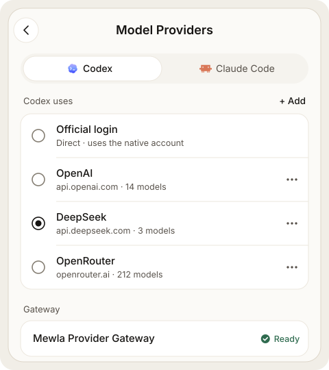
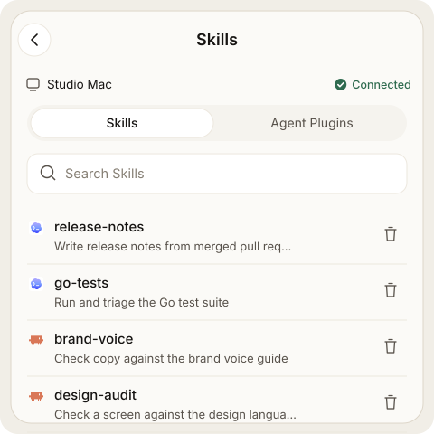

# Agents and models

Mewla runs the agent CLIs already installed and signed in on your computer.
This page covers which ones it runs, how much they may do without asking,
which model endpoints they use, and which Skills they load.

## Built-in agents

An **executor** is a named launch command. With no configuration, Mewla knows
these; one installed, signed-in CLI is enough:

| Executor | Command | Approval prompts |
| --- | --- | --- |
| `claude` | `claude` | The CLI's own policy |
| `codex` | `codex` | The CLI's own policy |
| `agent` (Cursor) | `cursor-agent --force --sandbox disabled` | Bypassed |
| `grok` | `grok --no-alt-screen --permission-mode bypassPermissions` | Bypassed |
| `pi` | `pi` | None; Pi is always permissive |
| `opencode` | `opencode` | The CLI's own policy |
| `dsh` | `dsh` | Opens the DSH web harness, not a terminal agent |

A Session's type follows the program that actually runs: a Cursor Session using
a Claude model is still a Cursor Session.

## executors.toml

`~/.mewla/executors.toml` is optional. `mewla setup` writes one with prompts:

```sh
mewla setup
mewla setup --non-interactive --host codex --profile safe
```

`--host` is the executor that runs Brain. `--profile` is `safe` or
`autonomous` (autonomous needs `--yes` without prompts). Setup never installs
packages, runs `sudo` or signs in to providers.

To edit it by hand, add one `[[executors]]` entry per command. An entry with a
built-in name overrides it; any other name adds a custom terminal agent:

```toml
[[executors]]
name = "claude"
command = "claude --model claude-opus-5-5"

[[executors]]
name = "aider"
command = "aider"
```

Restart `mewla` after a change. The file only lists launch commands; Brain
chooses which one each Worker uses (see
[Worker routing](brain-and-work.md#worker-routing)).

## Permission bypass risks

Unattended work from a phone means agents run tools and shell commands without
asking. On a machine with secrets or production access, that is dangerous.

**Sessions you start** use the command as configured. The built-in `agent` and
`grok` commands bypass approvals, and `pi` is always permissive.

**Brain Workers and Calendar scheduled actions** always run unattended. Mewla
adds these flags whatever the configuration says:

| Agent | Added for unattended work |
| --- | --- |
| Codex | `--dangerously-bypass-approvals-and-sandbox` |
| Claude Code | `--permission-mode bypassPermissions` (a weaker mode such as `acceptEdits` is rejected) |
| Cursor Agent | `--force --sandbox disabled --trust --approve-mcps` |
| Grok | `--permission-mode bypassPermissions --sandbox off` |
| OpenCode | `--auto` |
| Pi | Nothing. Calendar may add `--no-extensions` |

So:

1. On a machine with secrets or production access, use the safe profile for
   Sessions you start, and do not give that machine's work to Brain.
2. Use Brain and scheduled actions only where you accept an agent changing
   things without asking.
3. Model providers see what agents send them.

### Safe profile

With this file, Sessions you start ask for approval in their terminal. Delete
the agents you don't use, then restart `mewla`. `mewla setup --profile safe`
writes the same thing.

```toml
[[executors]]
name = "codex"
command = "codex"

[[executors]]
name = "claude"
command = "claude"

[[executors]]
name = "agent"
command = "cursor-agent"
kind = "cursor"

[[executors]]
name = "grok"
command = "grok --no-alt-screen"

[[executors]]
name = "pi"
command = "pi"
kind = "pi"

[[executors]]
name = "opencode"
command = "opencode"
kind = "opencode"
```

## Model Providers



**Settings > Agents > Model Providers** decides where Codex and Claude Code
send model requests. Pick the client, then its connection:

| Connection | Requests go to |
| --- | --- |
| Official login | The provider, using the CLI's own sign-in on the computer |
| OpenAI, Anthropic, DeepSeek, OpenRouter | That provider, with your API key |
| Custom Gateway | Your endpoint, with your key |

Keys are stored on the daemon and never shown again; leaving the key field
empty keeps the saved one. For a custom Claude gateway, enter the endpoint
root, including any proxy path, optionally ending in `/v1`.

**How requests are routed.** The daemon runs one local gateway
(`127.0.0.1:3425`, or the next free port). On each start it points Codex (a
marked block in Codex's `config.toml`, backed up first) and Claude Code
(`ANTHROPIC_BASE_URL` and a placeholder token in `~/.claude/settings.json`) at
that gateway. So a CLI you start in a plain terminal or an IDE uses the
selected connection too. The gateway swaps in the real key and forwards the
request unchanged. Running Claude Sessions use a new connection from their next
request.

**Images and web search in Codex.** Codex's built-in `image_gen` and `web.run`
tools call their own endpoints (`/v1/images/generations`, `/v1/images/edits`,
`/v1/alpha/search`). The gateway sends these to the selected Codex connection,
once and without retry, so that connection must serve them (for example
`gpt-image-2`). Codex also hides `image_gen` while it is signed in to a free
ChatGPT plan, even when requests go through the gateway. To offer it anyway, add
`-c cli_auth_credentials_store="ephemeral"` to the Codex executor command. That
launch then ignores the stored sign-in and leaves the file in place.

Codex always asks `image_gen` for `gpt-image-2`. To use another image model, set
`image_model` on the Codex connection:
`mewla providers image-model set gpt-image-2.5-sunburst` (selected connection;
`--connection <id>` for another), `mewla providers image-model show`, and
`mewla providers image-model clear`. The gateway then replaces the model on
`/v1/images/generations` and `/v1/images/edits` (JSON or multipart bodies) and
leaves `/v1/alpha/search` alone. The next image call uses the new setting, with
no Codex restart. Without it, image requests pass through unchanged. The
setting is stored as `image_model` in `model-profiles.toml`.

While the daemon is stopped, the gateway refuses connections. To use a CLI
without Mewla, restore its backup or remove those two Claude settings.

**Models.** Mewla lists what a connection offers, from the provider's live
catalog when it can. Choosing a connection sets no default model: each CLI
keeps its own (for Claude Code, whatever you chose with `/model`). A model
picked for one Session applies to that Session only.

The Model Provider and Brain's executor are separate choices; changing one
never changes the other.

## Skills and Agent Plugins



**Skills**, in the menu, lists the Skills your agents load on the current
server: Codex built-ins, each agent's global and project Skills, shared Skills
in `~/.agents/skills`, and Skills that come from Agent Plugins. A Skill found in
several places shows each copy and its location.

Open a Skill to see its description, files, the agents it is available to and
every copy. **Delete Skill** removes exactly the copy you opened, after you
confirm. Built-in copies and copies owned by an Agent Plugin are protected.

The **Agent Plugins** tab lists the plugins installed for Claude Code and
Codex, with the Skills, MCP servers and apps each one brings. A plugin can be
uninstalled from there, after you confirm.

## Check your agents

```sh
mewla doctor
```

It reports which configured agents are on `PATH`, hints when one looks signed
out, and exits nonzero when the machine is not ready.
