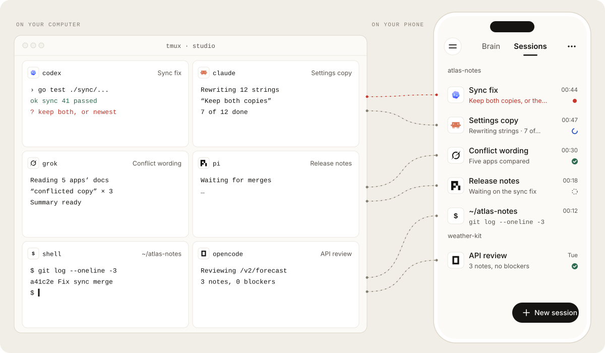
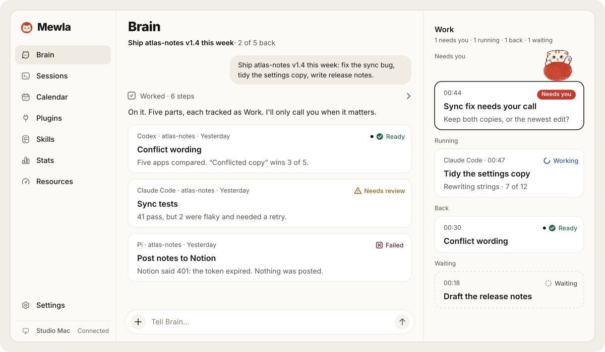

# Get started

From nothing to your first goal in about ten minutes. This page is one path;
[Install and update](install-daemon.md) and [Connect and pair](connect-and-pair.md)
cover the alternatives.

## The pieces



- **The daemon** (`mewla`) runs on your computer next to your repositories,
  `tmux` and agent CLIs. It owns Sessions, Brain, Work and pairing. One binary,
  no cloud service.
- **The app** on Android or iOS connects to one daemon at a time. The daemon
  also serves it as a web page.
- **Your agent CLIs** (Claude Code, Codex, Cursor Agent, Grok, Pi, OpenCode)
  do the work. Mewla starts and reads them; you sign in to each yourself.

Your code, keys and agent state stay on your computer.

## What you need

- Linux (`amd64` or `arm64`), WSL2, or an Apple Silicon Mac
- `tmux`
- One agent CLI on `PATH`, already signed in
- An arm64 Android phone, an iPhone with a source build, or a browser

## 1. Install the daemon

```sh
curl -fsSL https://raw.githubusercontent.com/daoleno/mewla/main/install.sh | sh
```

It verifies the release checksum, installs `mewla` without `sudo`, sends no
telemetry and finishes by running `mewla doctor`. Fix anything `doctor`
reports before you go on.

## 2. Start it and pair your phone

On a network you trust (home Wi-Fi, not a café):

```sh
mewla --lan
```

With no device paired yet, it prints a QR code and a pairing link. Install the
app (the Android APK from [Releases](https://github.com/daoleno/mewla/releases),
or [iOS from source](install-daemon.md#ios)), open it and scan the code. The
code works once and expires; `mewla pair` prints a fresh one.

Away from home, use Tailscale or an HTTPS tunnel instead of `--lan`; see
[Connect and pair](connect-and-pair.md).

## 3. Start a Session

Open **Sessions**, tap **New session**, pick one of your repositories and tap
an agent. Ask it something small. Switch between **Chat** and **Terminal** from
the Session's ⋯ menu: both are the same `tmux` pane, which you can also attach
to at your desk with `tmux attach`. More in [Sessions](sessions.md).

## 4. Give Brain a goal

Open **Brain** and tell it something with a few parts, for example "Fix the
failing test in sync/, then update the changelog". Brain splits it into Work,
starts Workers you can watch in Sessions, and puts a slip in the conversation
for each part. It calls you only when a slip needs your decision. More in
[Brain and Work](brain-and-work.md).



Workers run without asking for approval. Before you leave Brain working on a
machine with secrets, read [Permission bypass risks](executors.md#permission-bypass-risks).

## Find your way

| On a phone | On a wide screen (1024 pt and up) |
| --- | --- |
| ☰ opens the menu; the top bar switches **Brain · Sessions**; ⋯ holds the current page's actions | The menu is a sidebar with Brain and Sessions on top; ⋯ is the same |

The menu holds everything else, each in exactly one place: Calendar, Plugins,
Skills, Stats, Resources and Settings.

## Next

- Keep the daemon running across reboots: [Install and update](install-daemon.md#keep-it-running)
- Reach it from anywhere, add a tablet or a browser: [Connect and pair](connect-and-pair.md)
- Get a push only when something needs you, or talk to Brain from Telegram: [Notifications and Telegram](notifications.md)
- Choose models and keys, or lock agents down: [Agents and models](executors.md)
