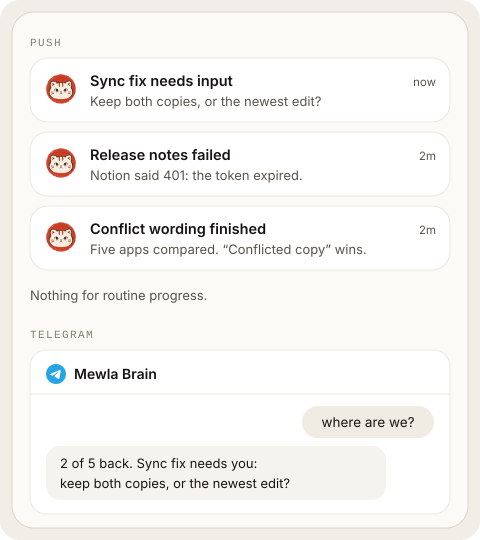

# Notifications and Telegram

Mewla interrupts you only when an agent needs you or finished while you were
away. It is not a progress feed.

## Push notifications

The daemon sends a push for three agent states:

| State | Title | Priority |
| --- | --- | --- |
| Needs input | `<name> needs input` | High |
| Failed | `<name> failed` | High |
| Finished | `<name> finished` | Default |

The name is the Session's alias or project, not a raw `tmux` name. "Finished"
means the Session ended, not that the task succeeded; open it to check.

Mewla stays silent while an agent is running, while its state is unknown, and for
connection changes.

If you are looking at that exact Session in the app, Mewla does not notify you.
Anywhere else, including another Session or with the app in the background, it
sends the push.

Calendar sends two other kinds of alert:

- **Reminders** are scheduled on the phone itself, so they fire without a
  connection to the daemon.
- A **scheduled action** sends one push when its result is ready, which opens
  the Brain thread that holds the result. The alert never contains the result
  itself.

Each push is a single attempt. If delivery fails or the daemon restarts at the
wrong moment, there may be no alert, but the state and results are still there
when you open the app.

Push delivery in your own builds of the app needs your own Expo project; Mewla
works without push.

## Telegram

Telegram is a second way to talk to the current server's Brain and Workers. It
uses a Telegram bot that you create; messages go to the same Brain thread as
the app.

### Connect

1. Create a bot with Telegram's [BotFather](https://t.me/BotFather) and copy
   its token.
2. In the app, open **Settings > Channels > Telegram**, paste the token and tap
   **Verify token**.
3. Tap **Connect Telegram**. It opens a short-lived link to your bot; tap
   **Start** in the bot chat. Mewla binds to your Telegram account and private
   chat, not to a username.

**Disconnect** pauses delivery and keeps the binding; **Reconnect** resumes it.
Messages sent while disconnected are not delivered later. **Advanced** holds
token replacement, unlinking your account and removing the bot.

From the computer, `mewla telegram setup`, `status`, `enable` and `disable`
configure the running daemon. They never take a token as a command-line
argument.

### Talk to Brain and Sessions

Plain messages go to Brain. If your bot chat has topics enabled, Mewla creates a
**Brain** topic and one topic per Worker Session; writing in a Session's topic
sends to that Session. When a Session is gone for good, its topic and its
messages are deleted. Pin the Brain topic yourself in Telegram if you want it
on top.

| Command | Effect |
| --- | --- |
| `/sessions` | List current Worker Sessions |
| `/use <number or session id>` | Send following messages to that Session (chats without topics) |
| `/brain` | Go back to Brain |
| `/status` | Show the current Session, turn and Work state |
| `/new` | Start a fresh Brain thread (in a Session topic it does not reset Brain) |
| `/help` | Show the command list |

A selected Session that disappears stays selected and unavailable, so your next
message never silently goes to Brain instead.

### Files

Photos, documents, voice notes and stickers you send reach Brain or the
selected Session as attachments, the same way as uploads from the app. Limits:
20 MiB per file or album, ten files per album. Mewla does not transcribe audio or
interpret video; what the agent can do with a file depends on the agent. Mewla
replies "Files received by Mewla" once the files are accepted.

Replies from Brain and Sessions arrive as text. Mewla does not send files back to
Telegram.

### What Telegram can see

Bot chats are Telegram cloud chats, so Telegram stores their history. Removing
Mewla's configuration does not delete that history. Only your own account in the
bound private chat can send input; groups and other users are ignored.
