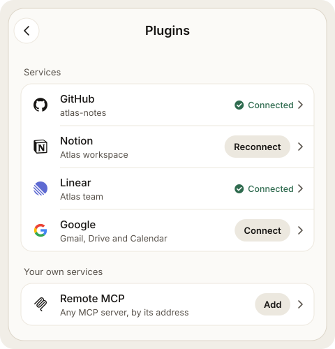

# Plugins

Plugins connect Brain and its Workers to services you use: Linear, Notion,
GitHub, Slack, Google Workspace, and custom MCP or OpenAPI services. Plugins
are a **preview**.

Connected accounts belong to the current server. Switching servers in the app
shows that server's accounts and never moves an account between servers.

## Connect a service



1. Open the menu and choose **Plugins**. Each service has one row.
2. Tap **Connect** on the service's row.
3. Sign in on the service's own page and approve Mewla.
4. You land back on Plugins with the service **Connected**. Brain can read and
   search it right away.

The card at the top of Plugins follows the sign-in: **Waiting for Linear**
while you are on the service's page (with **Open Linear again** and **Cancel**),
then the result. After a connect it offers **Allow changes too**; you can skip
it and allow changes later on the service's page.

From the web UI, the service returns your browser tab to the web UI's own
Plugins page. From the phone app it returns to the app.

For GitHub, Mewla shows a device code in large type; tap **Copy code and open
GitHub** and enter it on GitHub's page. You can also choose **Use the GitHub
login on this server**, which imports the account the GitHub CLI (`gh`) is
signed in to on your computer. Mewla shows the identity first and copies it only
after you confirm.

There are no tokens, client IDs or callback URLs to type for built-in services.

## Sign-in availability

First-time sign-in is not yet available for every service, because some need
Mewla's own app registration with the provider:

| Service | Sign-in | From the web UI |
| --- | --- | --- |
| Linear | Official browser sign-in | Returns to the web UI's Plugins page |
| Notion | Official browser sign-in | Returns to the web UI's Plugins page |
| Remote MCP | The server's own sign-in, or a token | Returns to the web UI's Plugins page |
| GitHub | Device code, or import from `gh` | Code page opens in a new tab; Plugins updates when you're done |
| Slack | Shows **Not yet available** until Mewla's Slack app registration ships | Slack's app returns only to the Mewla app: connect Slack from the phone |
| Google Workspace | Shows **Not yet available** unless your daemon already has Google sign-in configured | Google opens in a new tab; Plugins updates when you're done |

A service that cannot be connected yet shows **Not yet available** with a short
reason. Accounts you already connected keep working.

## What Brain can do

Tap a service's row to open its page. Every connected account is listed there,
each with its status and two switches:

- **Read and search**: on after sign-in.
- **Make changes when asked**: off until you turn it on. If the service only
  granted read access, the switch is an **Allow** button instead: the service
  asks you once more, then the switch is on.

**Tools & activity** lets you allow or block single tools, inspect a tool's
schema, run a status check and see recent calls. New tools a service adds later
need your review before use; until then, **Read and search** says so.

Permission is not an instruction. Even with changes allowed, Brain should send
messages or update records only when the task you gave it calls for that.
Writes are never retried automatically.

An account's status is **Connected**, **Needs sign-in again**, **Off** or
**Last call failed**. When an account needs something, its row on Plugins and
its card on the service page show one action: **Reconnect** when sign-in
expired, **Turn on** when it is off, **Check again** after a failed call, or
**Retry** when removing its credentials did not finish.

To add a second account, use **Add another account** at the bottom of the
service's page. It is the same sign-in as Connect.

## Custom services

Under **Your own services** you can add an MCP server or an OpenAPI service by
endpoint or document. Custom endpoints must be public HTTPS by default. To reach
a service on your own network, grant that account an explicit address range;
cloud metadata and link-local addresses are always refused. Custom services get
no automatic permissions: after connecting one, choose its tools.

## Disconnect

On the service's page, tap **Disconnect** on the account and confirm on the same
card. Mewla disables the account first, so later calls fail even if revoking it
at the provider needs a retry. Some providers do not support revocation from
Mewla; in that case also remove Mewla's access in the provider's settings.

## Use plugins from the computer

Brain and Workers use the same accounts through the CLI:

```sh
mewla connections list --json
mewla connections search --query github --json
mewla connections describe --id ACCOUNT_ID --tool get_me --json
mewla connections invoke --id ACCOUNT_ID --tool get_me --args '{}' --json
```

Each call is one bounded request; nothing pages automatically.

## Where credentials live

Tokens stay on the daemon, in a private vault file readable only by your user.
Account history records which tool was called and when, but not tokens,
arguments or results.
