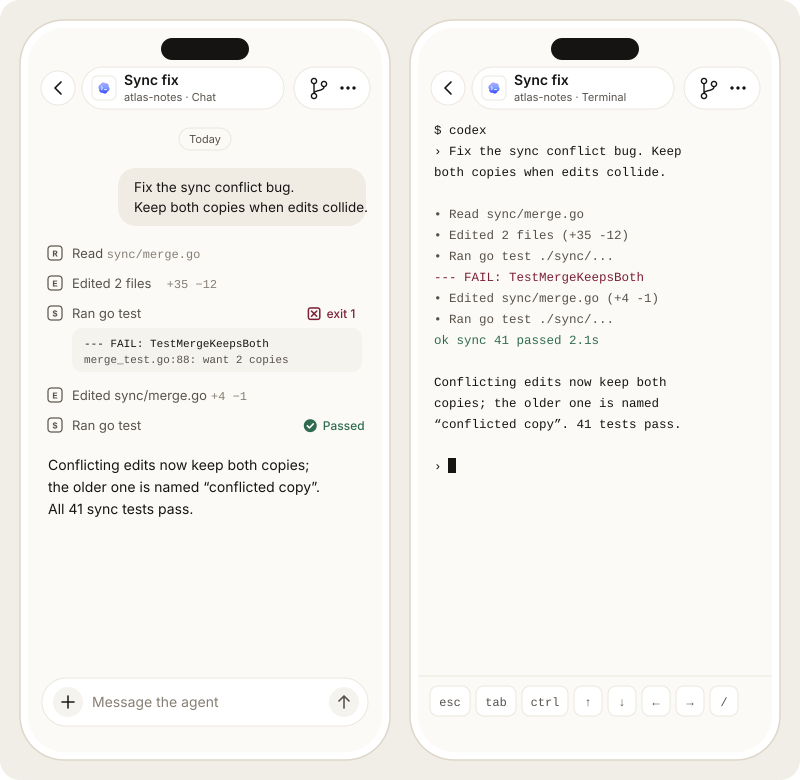
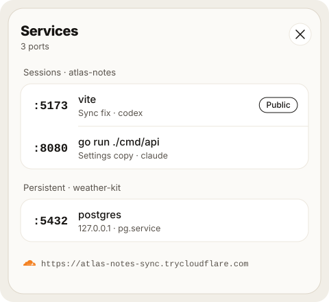

# Sessions

A **Session** is one agent or shell running in `tmux` on your computer. Mewla
starts it, lists it and lets you read or drive it from the phone. Because it is
plain `tmux`, the same Session is there when you sit down at the desk.

## Start a Session

In **Sessions**, tap the **New session** pill (or ⋯ > **New session**), pick a
directory and tap what to run:

| Choice | Runs |
| --- | --- |
| Claude, Codex, Cursor, Grok, Pi, OpenCode | That agent CLI, using the command from [Agents and models](executors.md) |
| Shell | Your login shell |
| DSH | The DSH harness, opened as a web page rather than a terminal |

**Advanced** lets you set the working directory, any command (for example
`claude --permission-mode auto`) and a window title.

The agent must already be installed and signed in on the computer; Mewla never
signs in for you.

## The list

Sessions are grouped by directory. Each row shows the agent, the Session's
name, its latest line and, on the right, its state mark: a spinning arc while
it works, a red dot when it needs you, a crossed box when it failed, a check
when it finished.

Brain's Workers are ordinary Sessions and appear here too. Long-press a row to
select several and terminate them together.

## Chat, Terminal and Git



Open a Session to read it in one of three ways:

- **Chat**: the structured conversation, with your messages, the agent's
  replies, tool calls, plans and attachments. Available for Claude, Codex,
  Cursor, Grok, Pi and OpenCode.
- **Terminal**: the live terminal, rendered natively. Works for any command,
  including a Shell. A key row above the keyboard adds Ctrl, Esc, Tab and arrows.
- **Git**: read-only All, Working and Staged diffs for the Session's
  repository. Reading a diff never stages or discards anything.

What you type in either Chat or Terminal goes to the same `tmux` pane.

A Session's ⋯ menu holds:

| Item | Does |
| --- | --- |
| Open terminal / Open chat | Switch between the two views |
| New Terminal | Start a Shell in the same directory |
| Rename | Change the Session's name |
| Model | Pick the model for this Session only |
| Open Web | Open a DSH Session's web page |
| Open Brain | Jump to the Brain conversation about this Worker's Work |
| Terminate | Stop the Session, after you confirm |

Items appear only where they apply: Open Web for DSH, Open Brain for a Worker.

## Services



Agents start dev servers, previews and APIs. **Services**, in the Sessions ⋯
menu, lists the ports they listen on, by project:

| Source | Shown when |
| --- | --- |
| Session | A process inside a live Session listens on a port. The row opens that Session's terminal. |
| Persistent | A registered user `systemd` unit is running and listening. It has no terminal. |

A service bound only to `127.0.0.1` is marked local; Mewla does not invent a
network URL for it. A registered unit that stopped shows **Inactive**; one
whose state cannot be read shows **Error** with the reason.

### Keep a service after its Session ends

A service started outside `tmux`, such as a user `systemd` unit, stays hidden
until you register it. Registering never starts, stops or changes the unit:

```sh
mewla service register -unit my-preview.service -name "Docs preview" \
  -project docs -port 3080 -cwd ~/projects/docs
mewla service list --json
mewla service unregister -unit my-preview.service   # removes the registration only
```

Only plain user unit names are accepted. Registrations survive daemon restarts
and Worker cleanup, and Mewla checks on every refresh that the unit is running
and owns the port. This needs Linux with a user `systemd`.

### Share one with a temporary public URL

A service row can start a Cloudflare **Quick Tunnel**: a random
`trycloudflare.com` URL for that one service. It needs `cloudflared` on the
computer, but no Cloudflare account.

- **Anyone with the URL can reach the service.** Do not tunnel anything that
  holds secrets or has no login of its own.
- Mewla starts a tunnel only when you tap it, and first checks that the
  service answers HTTP.
- The tunnel follows the process that owns the port: if it exits, the tunnel
  stops. Stopping a tunnel never stops the service.
- URLs live in memory only. After a daemon restart there is no tunnel until you
  start one again.
- Cloudflare limits Quick Tunnels to 200 concurrent requests and does not
  support Server-Sent Events.

Mewla runs `cloudflared` with an empty configuration and never touches your own
named tunnels or `~/.cloudflared`. Quick Tunnels need a Linux daemon.

From the computer, with the ID and generation from `mewla service list --json`:

```sh
mewla service tunnel start  -id SERVICE_ID -generation PROCESS_GENERATION
mewla service tunnel status -id SERVICE_ID -generation PROCESS_GENERATION
mewla service tunnel stop   -id SERVICE_ID -generation PROCESS_GENERATION
```
