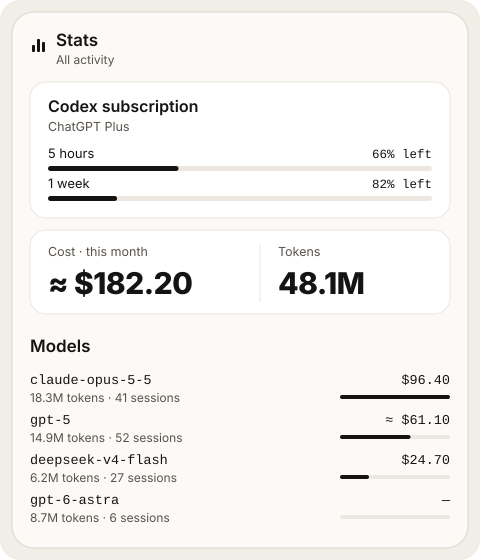
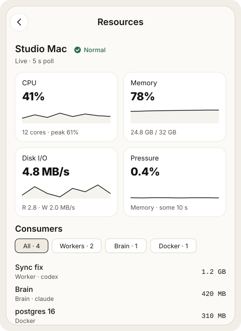

# Usage and resources

Two screens answer "what are my agents consuming?": **Stats** for tokens and
cost, **Resources** for CPU, memory and disk on the computer. Both open from
the menu and show the current server only; Mewla never adds several computers
together.

## Stats



Stats reads the agents' own history on the computer and shows, per model,
tokens, sessions and cost for the range you pick. Tap a model for input,
output and cache tokens, the price source and when it was refreshed.

Costs come in four kinds, kept apart:

| Kind | Meaning |
| --- | --- |
| Reported | The agent's history recorded an actual charge |
| Estimated | Priced from a public reference price list; marked `≈` |
| Mixed | Part reported, part estimated |
| Unknown | No known price; shown as `—`, never as zero |

Estimates use public reference prices; your provider or gateway may bill
differently.

When Codex is signed in with ChatGPT and uses **Official login**, Stats also
shows the plan's usage windows (for example 5 hours and 1 week) with the share
left.

Per agent:

- **Claude Code**: read from `~/.claude/projects` (or `$CLAUDE_CONFIG_DIR/projects`)
  every five minutes, including traffic through a Custom Gateway. Costs are
  reference estimates, not your subscription bill.
- **Codex**: each request is priced at its own context size, so long-context
  tiers apply per request.
- **OpenCode**: read from OpenCode's local database, the one
  `opencode db path` reports (or `MEWLA_OPENCODE_DB`).
- **Pi**: read from `~/.pi/agent/sessions` (or `$PI_CODING_AGENT_DIR/sessions`).

## Resources



Resources is a live view of the computer, refreshed every five seconds while
it is open:

- **CPU, Memory, Disk I/O and Pressure** cards, each with the last minutes of
  history. Pressure is Linux PSI. **Details** adds per-core activity, load
  averages, cache and swap, mount space, and PSI averages.
- The pressure state (normal, elevated or critical) and the signals that crossed
  a threshold.
- **Consumers**: processes grouped by owner (Workers, Orphaned Workers, Brain,
  Docker, User), sorted by memory (RSS) or CPU. Tap one for its command, folder
  and process list. An orphaned Worker shows **Residual** next to its last
  status.

When pressure turns elevated or critical, Brain is told and decides what to do,
such as waiting before it starts more Workers or closing one. Mewla itself never
kills or throttles a process.

A state change needs 20 seconds of sustained pressure. To change a threshold,
put the values you want in `~/.mewla/resource-telemetry.json`; it is reread on
every sample, no restart needed:

```json
{
  "available_memory_percent": { "elevated": 15, "critical": 7 },
  "cpu_busy_percent": { "elevated": 90, "critical": 98 },
  "disk_free_percent": { "elevated": 10, "critical": 3 }
}
```

If the connection drops, the last sample stays on screen marked **Last
sample**.
